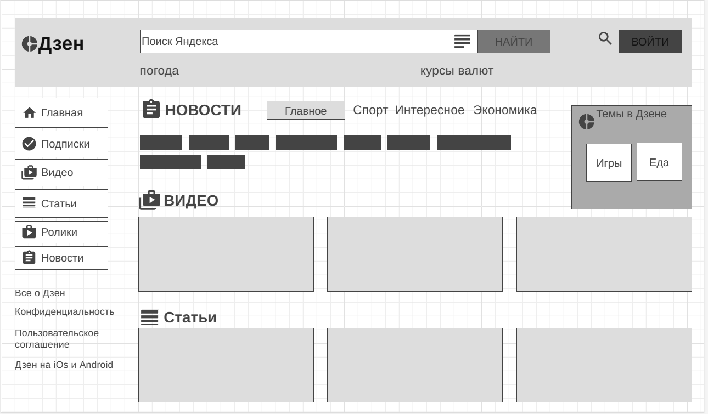

1. youtube использует протокол ssl, об этом свидетельствует знак замка в начале адресной строки плюс указание https;
;

2. Описание сайта wikipedia;
Дизайн всего сайта строгий, лаконичный.
В шапке(head) сайте:
- Данные пользователя и сервис для управления учетными записями и регистрации новых пользователей;
- Ссылка на статью, форум для ее обсуждения, сервис для редактирования и другие действия со статьей; 
- Поисковая строка; 
Верхний левый угол занимает также шапка с изображдением - главным логотипом википедии, узнаваемый пользователями.
Слева - навигационная панель. В ней содержатся:
- Ссылки на основные сервисы (главную страницу, содержание википедии, избранные статьи)
- Участие в создании википедии (сообщить об ошибке, руководство по правке статей и т.д.)
- Инструменты (служебные ссылки)
- Печать (переводит страничку в редактор для печати на принтер)
- Другие полезные ссылки (выбор языка, тематики википедии и т.д.)
Основной контент делится на три части. 
- Заголовок статьи. Выделяется жирным цветом и подчеркнут.
- Содержание статьи с ссылками на другие статьи и литературу.
- справа в углу изображение - портрет, карта, схема, относящиеся к статье.
В подвале (footer) сайта:
- Дата последнего редактирования статьи;
- Важная информация о правах об авторстве, лицензии, прав на зарегистрированный знак википедии;
- Политики безопасности и другая важная юридическая информация для пользователей;
- Данные о разработчиках, статистике сайта, куки и т.д. 

;

3. Изменения на сайте внесены в текст (большими буквами) в стили и добавлена картинка;
 и ;

4. прототип низкой детализации сайта dzen.ru с помощью сайта wireframe.cc.
.

